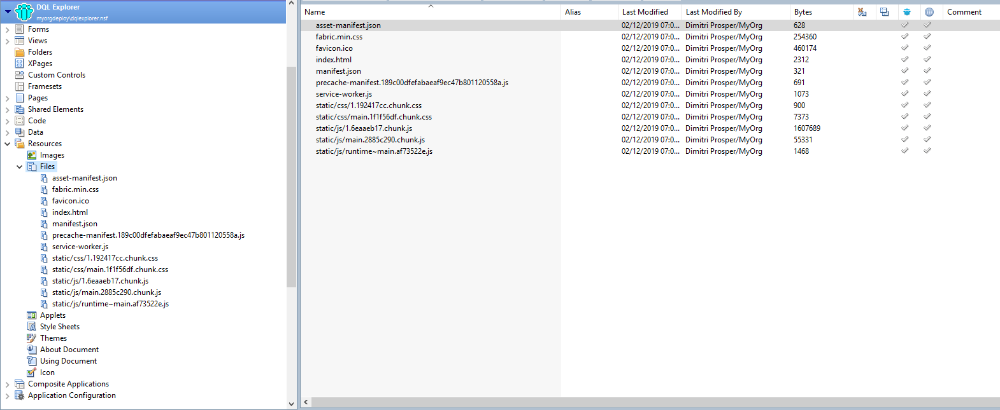

This project is an exploration of data in Domino databases leveraging Domino Query Language.
## Quickstart
If you are here to try out DQL Explorer, learn about DQL and just want to get started... then:

Preparation:
1. Download the dqlexplorer.nsf
2. Deploy it to a Domino 10.0.1 Server (into the data directory root, not a sub directory for now)
3. Sign the database with your signer ID, you can use the server id for instance.
4. Set an appropiate ACL - as the database allows to create and store DQL queries, you want to define some users with Author access.
5. Access the database with a browser: https://<domino_server_url>/dqlexplorer.nsf/index.html
6. DQL Explorer is just a gateway to access other databases data. So you now need to  have DQL Explorer list some databases you want to use. 
7. As of now, DQL requires that you issue these commands on the Domino console:

load updall <database> -e

load updall <database> -d
  
Now you are ready to create your first DQL Query. As an example we want to use names.nsf

1. Add names.nsf to the listed databases
2. load updall names.nsf -e
3. load updall names.nsf -d
4. Define your query
5. Run your query

## Watch the demos

Luis Guirigay and Andrew Manby introduce DQL Explorer at Think 2019: https://youtu.be/OMjSND5cPsE

Scott Good provides a demo that includes some configurations aspects not shown in the stage demo: https://youtu.be/Cfw_6Wvk8c8

## Release Notes

Go to the [Releases tab](https://github.com/icstechsales/dql-explorer/releases) for the latest version and update notes.

## Requirements

The Domino Query Language (DQL) uses design data extracted from view notes. This information is stored in a special database called a design catalog and named GQFDsgn.cat.  You must create a design catalog before ~a Node.js developer~ any attempts to use DQL, using DQL Explorer, Node.JS, LotusScript, Java, server console, etc... to query any database. Now that I slightly corrected the documentation, feel free to follow the remainder of the steps as outlined in the [DQL documentation](https://doc.cwpcollaboration.com/appdevpack/docs/en/design-catalog-admin.html) to create the design catalog and add your target databases to it.

## Configure

Note: Try this on a development server.  

- Clone this repository. 
- Using the dqlexplorer.ntf template create a new database called dqlexplorer.nsf (currently it needs to be deployed in the root of your data directory).
- If you previously deployed dqlexplorer.nsf to your server, you should use the dqlexplorer.ntf to replace (or refresh) the design on your dqlexplorer.nsf.
- The database runs a number of agents, you will need to sign the database so the agents can run on your server. 
- The Web application relies on Domino Access Services (DAS) being enabled on the dqlexplorer.nsf (default), but that means there is a need to be enable DAS on your server.  The following example show how to enable the Data service on a server.

  - If internet site documents are enabled, do the following:

    a.	Create or edit an internet site document.

    b.	On the Configuration tab, under Domino Access Services, edit the Enabled services field. Type 'Data' to enable the data service.

    c.	Save the document.

  - If internet site documents are disabled, do the following:

    a.	Edit the server document.

    b.	On the Internet Protocols tab, click Domino Web Engine.

    c.	Under Domino Access Services, select 'Data' for Enabled Services.

    d.	Save the document.

- Configure the ACL as you would any Domino database.  The roles DQLXAuthors and DQLXReaders will give those that belong to these roles either reader or author access to all queries stored in the database, only give it to administrators or department admins.  All users with regular Author access to the database can create/share queries without needing these roles. 
- Edit the lookup document in the dqlexplorer.nsf and setup directories or databases that you want to make available via the DQL Explorer (see Scott's demo of that here: https://youtu.be/Cfw_6Wvk8c8?t=440).
- For development, update the package.json in this project to point the proxy (domino_server_url) and homepage (domino_server_url/dqlexplorer.nsf) to your Domino server's url, use http (not https).

## Available Scripts

In the project directory, you can run:

### `npm install`

This process may run for less than 2 minutes. It installs all the npm modules required for this project.  You only need to run it once or if you add/update the modules defined in the package.json.

### `npm start`

Runs the app in the development mode.

Open [http://localhost:3000](http://localhost:3000) to view it in the browser.

The page will reload if you make edits.

You will also see any lint errors in the console.

### `npm run build`

Builds the app for production to the `build` folder.

It correctly bundles React in production mode and optimizes the build for the best performance.

The build is minified and the filenames include the hashes.

Your updated version of the app is ready to be deployed to the dqlexplorer.nsf domino database under the Resources...Files as shown below, make sure to include the appropriate path for css and js files when the files are added by changing the filenames after import to include the path, i.e. static/js/... or static/css/...

Once deployed the application is accessbile from any web browser accesing https://<domino_server_url>/dqlexplorer.nsf/index.html
